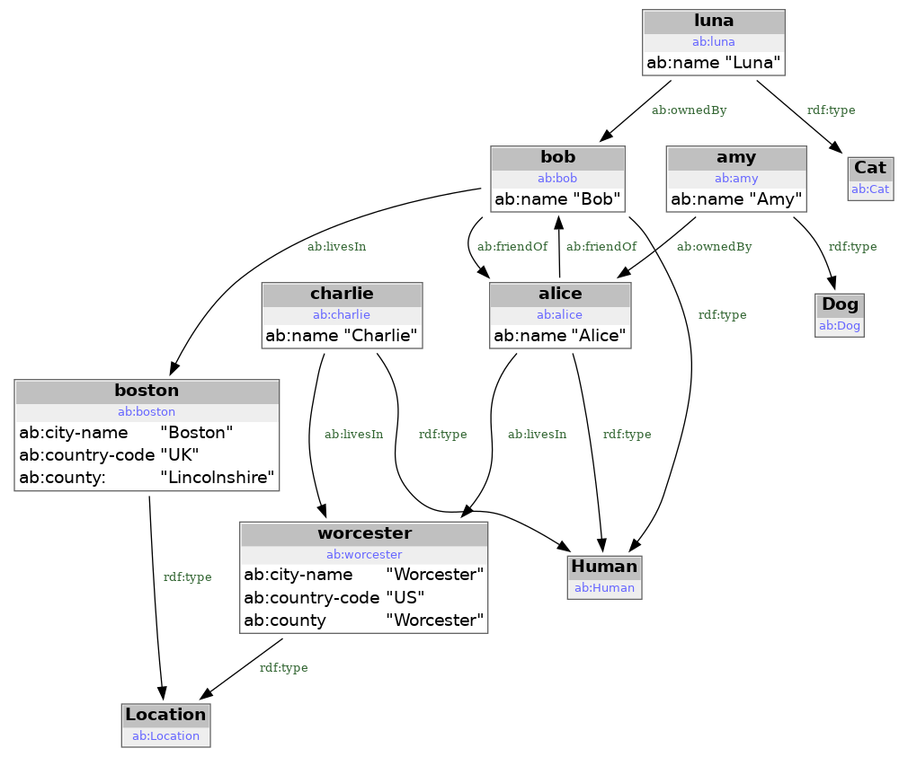
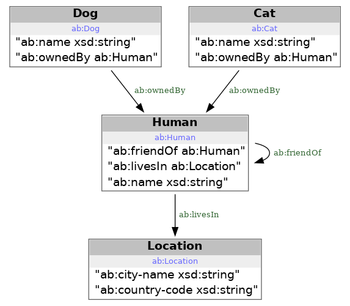

# Knowlege Graph for Practical Software Engeneering

## Preface

Knowledge Graph and related technologies were introduced by practitioners in the area of [knowledge representation](https://en.wikipedia.org/wiki/Knowledge_representation_and_reasoning). Historically KG technologies were used by data analysts and designers with purpose to build various ontologies and taxonomies to cover very wide areas of business and science. [Wikidata](https://www.wikidata.org/wiki/Wikidata:Main_Page) could be considered as famous example of such efforts - the project provides [SPARQL interface](https://www.wikidata.org/wiki/Wikidata:Request_a_query#Help_with_a_query) to allow queries using wikipedia data.

This document purpose is to provide practical alternative to the mainstream KG tutorials. After minimalistic introduction we are going to concentrate on few examples of purely technical utilization of **available** KG tech tools. In most cases it will be possible to easily reproduce this document scripts and queries using only python's [rdflib](https://pypi.org/project/rdflib/) and [graphviz](https://pypi.org/project/graphviz/) packages - i.e. no DB server install would be necessary.

## [R<span/>DF] and RDF/turtle

<u>Resource Definition Framework</u> ([R<span/>DF]) is standartized way to store the facts in the form of [R<span/>DF statements](https://www.w3.org/TR/rdf11-primer/#section-triple). Each such statement has three parts: *subject*, *predicate* and *object*. The example of few such statements using RDF/turtle format is given below:

```
@prefix rdf: <http://www.w3.org/1999/02/22-rdf-syntax-ns#> .
@prefix ab: <http://www.geisel-software.com/RDF/alice-bob#> .

ab:alice rdf:type ab:Human .
ab:alice ab:name "Alice".
ab:bob rdf:type ab:Human .
ab:bob ab:name "Bob" .
...
```
It is the data fragment from [ab.data.ttl] describing our version of ubiquitous [Alice-Bob pair](https://en.wikipedia.org/wiki/Alice_and_Bob). In plain english it is possible to interpret as:

 - there is a human named Alice identified as `ab:alice`
 - there is a human named Bob identified as `ab:bob`

URI is Uniform Resource Identifier. You can quickly glance to [few U<span/>RI examples](https://datatracker.ietf.org/doc/html/rfc3986#section-1.1.2) - as you see URI is quite practical and familiar notation often used in various web services. E.g. well-known URLs used in web browsers are special kind of URI.

In the example above `ab:alice` is equivalent to URI `<http://www.geisel-software.com/RDF/alice-bob#alice>`. They both can be used to identify the same person: Alice. `ab:alice` is an example of CURIE (compact <span>U</span>RI). RDF/turtle (or just turtle) allows to use compact U<span/>RIs via use of turtle `@prefix` directive. The same example where all statements are shown with prefixes applied:

```
<http://www.geisel-software.com/RDF/alice-bob#alice> <http://www.w3.org/1999/02/22-rdf-syntax-ns#type> <http://www.geisel-software.com/RDF/alice-bob#Human> .
<http://www.geisel-software.com/RDF/alice-bob#alice> <http://www.geisel-software.com/RDF/alice-bob#name> "Alice" .
<http://www.geisel-software.com/RDF/alice-bob#bob> <http://www.w3.org/1999/02/22-rdf-syntax-ns#type> <http://www.geisel-software.com/RDF/alice-bob#Human> .
<http://www.geisel-software.com/RDF/alice-bob#bob> <http://www.geisel-software.com/RDF/alice-bob#name> "Bob" .
```

As you see `ab:` was replaced *in verbatim* with corresponding prefix URI, the same opertaion was done for prefix `rdf`: all using `@prefix` directives found at the begining of turtle file.

turtle rules prescribe to enclose URIs inside of angle brackets to designate the string between brackets as URI. The angle brackets themselves are not part of URI. E.g. first line *predicate* is URI `http://www.w3.org/1999/02/22-rdf-syntax-ns#type`.

In the second line of the example you've seen that *object* could also be [R<span/>DF Literal]. In RDF/turtle the string l<span>iterals are in double-quotes to distibguish them from URIs. E.g. the third statement *object* is string *Alice*.

There are other ways to represent RDF triples: e.g. [R<span/>DF/XML](https://en.wikipedia.org/wiki/RDF/XML). However [RDF/turtle](https://en.wikipedia.org/wiki/Turtle_(syntax)) syntax plays special role. It used as important part of the query language called SPARQL. It is also main RDF representation in various W3C and similar formal documents.

So from this point:

 - any mention of [R<span/>DF] would assume RDF/turtle unless stated otherwise.
 - any literal is [R<span/>DF Literal] as defined by RDF/turtle document.

One more important wide-spread assumption is introduction of small list of well-known prefixes. It leads to situation when CURIEs are often called URIs assuming it is always possible to apply prefix expansion. Such expansion will be based on either well-known prefixes (often omit in the documents) or locally defined prefixes for particular RDF file or SPARQL query.

Most well-known prefixes are:
```
@prefix rdf: <http://www.w3.org/1999/02/22-rdf-syntax-ns#> .
@prefix rdfs: <http://www.w3.org/2000/01/rdf-schema#> .
@prefix xsd: <http://www.w3.org/2001/XMLSchema#> .
@prefix sh: <http://www.w3.org/ns/shacl#> .
@prefix dash: <http://datashapes.org/dash#> .
```

The same list is also given in addendum section [Well-known prefixes](/KGM-docs/addendum/#well-known-prefixes).
You can also lookup prefixes at [https://prefix.cc](https://prefix.cc). E.g. Friend-Of-A-Friend prefix link [foaf:](https://prefix.cc/foaf) will give you details of prefix and related defitions.

## RDF triples

Each RDF triple has three parts: *subject*, *predicate* and *object*.

You may think about RDF triples as extention of an idea of key-value pairs. We add *predicate* as the way to select particular KV mapping.

E.g. you may have such KV pairs stored in two separate file to capture the facts from first Alice-Bob example:

<hr/>
/// html | div[style='float: left; width: 50%;']
file <b>types.kv</b><br/>
alice: Human<br/>
bob: Human<br/>
///

/// html | div[style='float: right;width: 50%;']
file <b>names.kv</b><br/>
alice: Alice<br/>
bob: Bob<br/>
///

/// html | div[style='clear: both']
///
<hr/>

RDF makes two changes to key-value pairs idea:

 - as illustrated above RDF adds third element to the statement line so you now will have subject-predicate-object triples instead of key-value pairs.
 - RDF restricts what exactly could be *subject*, *predicate* or *object* and how exactly they represented. In most cases the parts of RDF triple can be either URIs or RDF literals.

## Knowledge Graph

Set of RDF triples can be thought of as [Knowledge Graph](https://en.wikipedia.org/wiki/Knowledge_graph) like this one below:

[][file examples/alice-bob/ab.data.ttl.png]
[file examples/alice-bob/ab.data.ttl.png]: examples/alice-bob/ab.data.ttl.png

This is graph view on data from [ab.data.ttl] file. In plain english the KG tells us about Alice and Bob:

 - they are friends.
 - Alice lives in the location `ab:worcester` which is clearly [Worcester, MA](https://en.wikipedia.org/wiki/Worcester,_Massachusetts) based on provided county name and country code.
 - Bob lives in `ab:boston`. Unlike intiution based on URI `ab:boston` Bob does not live in the capital of Commonwealth of Massachusetts. `ab:boston` is clearly [Boston, Lincolnshire](https://en.wikipedia.org/wiki/Boston,_Lincolnshire) in United Kingdom based on provided data.
 - both Alice and Bob owns pets: dog Amy and cat Luna.
 - there is one more person on diagram: `ab:charlie`. Charlie lives in the same place as Alice.

## SPARQL

SPARQL is the programming language to query and manipulate RDF knowledge graphs. The example of SPARQL select query and result using Alice-Bob dataset is below:
```
prefix rdf: <http://www.w3.org/1999/02/22-rdf-syntax-ns#>
prefix ab: <ab:>

select ?owner_name ?pet_name ?pet_class
where {
   ?pet rdf:type ?pet_class .
   ?pet ab:name ?pet_name .
   ?pet ab:ownedBy ?owner .
   ?owner ab:name ?owner_name .
}
```
[][file examples/alice-bob/adhoc-ab-rq-result.png]
[file examples/alice-bob/adhoc-ab-rq-result.png]: examples/alice-bob/adhoc-ab-rq-result.png

The idea of SPARQL is based on **variables binding**. When the query is executed, the RDF triples are searched for triples that match the patterns in the WHERE clause. For each match, the values are bound to the variables specified in the patterns. The SELECT clause then determines which of these variables are included in the result set.

If you want to experiment with this simple query you can install python package rdflib and use python scripts below. The scripts direct links: [r<span/>dflib-sparql-short.py](examples/rdflib/rdflib-sparql-short.py) and [r<span/>dflib-sparql.py](examples/rdflib/rdflib-sparql.py).

=== "short"

    ```python
    
    ```

=== "long"

    ```python
    
    ```
    
Expected result:
```
['Amy', 'Alice', 'ab:Dog']
['Luna', 'Bob', 'ab:Cat']
```

Besides locally installed python with rdflib you can use [S<span/>PARQL playground](https://atomgraph.github.io/SPARQL-Playground/) for more experimentation with Alice-Bob data.


## SHACL

SHACL is W3C standard. SHACL was designed as the mean to describe RDF knowledge graphs structure. It can be thought as graph database analog of 'database schema'.

SHACL specify constraint to graph dabase nodes. Graph below presents SHACL defitions from [ab.shacl.ttl] file.

[][file examples/alice-bob/ab.shacl.ttl.png]
[file examples/alice-bob/ab.shacl.ttl.png]: examples/alice-bob/ab.shacl.ttl.png

[S<span/>HACL playground](https://shacl.org/playground/)

<hr>

